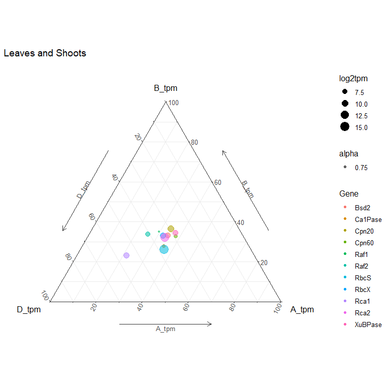

Wheat Rubiscosome Expression Balance Report
================

-   [1 Data Import](#data-import)
    -   [1.0.1 Data imported as triads](#data-imported-as-triads)
    -   [1.0.2 Create `initial_tidy`
        Function](#create-initial_tidy-function)
    -   [1.0.3 Compile all data into
        `Rubiscosome_exp_data`](#compile-all-data-into-rubiscosome_exp_data)
-   [2 Data Analysis](#data-analysis)
    -   [2.0.1 Split `Rubiscosome_exp_data` into three separte
        dataframes](#split-rubiscosome_exp_data-into-three-separte-dataframes)
    -   [2.0.2 ](#section)
-   [3 Data Vizualisation](#data-vizualisation)

# 1 Data Import

This study will only use data from the 7 studies listed below, that
report similar non stress growth conditions in their manuscript;

| Study Name                                                   | Study Code    |
|--------------------------------------------------------------|---------------|
| Developmental time-course of Chinese Spring                  | choulet\_URGI |
| Chinese Spring seedling and spikes at anthesis               | CS\_methylome |
| Chinese Spring leaves and roots from seven leaf stage        | Aneuploidy    |
| Chinese Spring early meiosis, early prophase                 | PRJEB25586    |
| Developmental time-course of Azhurnaya                       | Development   |
| Gene expression during a time course of flag leaf senescence | PRJNA497810   |
| Drought and heat stress time course in seedlings\*           | SRP045409     |

\*Data from this study will exclusively be used for the heat stress
analysis

### 1.0.1 Data imported as triads

``` r
Gene_IDs <- read.csv('Rubiscosome_Gene_IDs.csv')
Gene_IDs
```

    ##       Gene         A_Subgenome        B_Subgenome        D_Subgenome
    ## 1     Bsd2  TraesCS7A02G341000 TraesCS7B02G242200 TraesCS7D02G338600
    ## 2  Ca1Pase  TraesCS4A02G184100 TraesCS4B02G134600 TraesCS4D02G129300
    ## 3  Cpn20_1  TraesCS2A02G146000 TraesCS2B02G171400 TraesCS2D02G150600
    ## 4  Cpn20_2  TraesCS6A02G340300 TraesCS6B02G371500 TraesCS6D02G320800
    ## 5  Cpn20_3  TraesCS7A02G161000 TraesCS7B02G066000 TraesCS7D02G162300
    ## 6  Cpn20_4  TraesCS5A02G212500 TraesCS5B02G211200 TraesCS5D02G219500
    ## 7  Cpn60_1  TraesCS5A02G366800 TraesCS5B02G368900 TraesCS5D02G376000
    ## 8  Cpn60_2  TraesCS4A02G315500 TraesCS5B02G563900 TraesCS5D02G550700
    ## 9   RbcS_1  TraesCS2A02G066700 TraesCS2B02G079100 TraesCS2D02G065100
    ## 10  RbcS_2  TraesCS2A02G066800 TraesCS2B02G079200 TraesCS2D02G065200
    ## 11  RbcS_3  TraesCS2A02G066900 TraesCS2B02G079300 TraesCS2D02G065300
    ## 12  RbcS_4  TraesCS2A02G067000 TraesCS2B02G079400 TraesCS2D02G065400
    ## 13  RbcS_5 TraesCS2A02G067100  TraesCS2B02G079500 TraesCS2D02G065500
    ## 14  RbcS_6  TraesCS2A02G067200                                      
    ## 15  RbcS_7  TraesCS2A02G067300 TraesCS2B02G078900 TraesCS2D02G065600
    ## 16  RbcS_8  TraesCS5A02G165400 TraesCS5B02G162600 TraesCS5D02G169600
    ## 17  RbcS_9  TraesCS5A02G165700 TraesCS5B02G162800 TraesCS5D02G169900
    ## 18    Rca1  TraesCS4A02G177600 TraesCS4B02G140200 TraesCS4D02G134900
    ## 19    Rca2  TraesCS4A02G177500 TraesCS4B02G140300 TraesCS4D02G135000
    ## 20    Raf1  TraesCS1A02G142000 TraesCS1B02G159700 TraesCS1D02G141100
    ## 21    Raf2  TraesCS5A02G545700 TraesCS4B02G379500  TraesCSU02G129700
    ## 22  RbcX_1  TraesCS5A02G459200 TraesCS5B02G468800 TraesCS5D02G470300
    ## 23  RbcX_2  TraesCS2A02G198700 TraesCS2B02G226100 TraesCS2D02G206500
    ## 24 XuBPase  TraesCS7A02G335600 TraesCS7B02G247200 TraesCS7D02G343300

### 1.0.2 Create `initial_tidy` Function

-   Filters data for only the study codes in the above table
-   Adds a Gene and Triad column containing strings supplied under y and
    z
-   Renames the Gene\_ID column names to subgenome\_tpm e.g. `A_tpm`
-   Selects for only relevent columns

``` r
initial_tidy <- function(x, y="GeneName", z="Triad") {x %>%
    filter(study %in% c("choulet_URGI", 
                        "CS_methylome",
                        "Aneuploidy",
                        "PRJEB25586", 
                        "Development", 
                        "PRJNA497810",
                        "SRP045409")) %>%
    mutate(Gene = y,
           Triad = z) %>%
    rename(A_tpm = 13,
           B_tpm = 14,
           D_tpm = 15) %>%
    select("Gene",
           "Triad",
           "study",
           "High.level.tissue",
           "Intermediate.stress",
           "Stress.disease",
           "A_tpm",
           "B_tpm",
           "D_tpm")
  
}
```

``` r
Bsd2 <- initial_tidy(read.csv('Data/Bsd2.csv'), 'Bsd2', 'Bsd2')
Ca1Pase <- initial_tidy(read.csv('Data/Ca1Pase.csv'), 'Ca1Pase', 'Ca1Pase')
Cpn20_1 <- initial_tidy(read.csv('Data/Cpn20_1.csv'), 'Cpn20', 'Cpn20_1')
Cpn20_2 <- initial_tidy(read.csv('Data/Cpn20_2.csv'), 'Cpn20', 'Cpn20_2')
Cpn20_3 <- initial_tidy(read.csv('Data/Cpn20_3.csv'), 'Cpn20', 'Cpn20_3')
Cpn20_4 <- initial_tidy(read.csv('Data/Cpn20_4.csv'), 'Cpn20', 'Cpn20_4')
Cpn60_1 <- initial_tidy(read.csv('Data/Cpn60_1.csv'), 'Cpn60', 'Cpn60_1')
Cpn60_2 <- initial_tidy(read.csv('Data/Cpn60_2.csv'), 'Cpn60', 'Cpn60_2')
RbcS_1 <- initial_tidy(read.csv('Data/RbcS_1.csv'), 'RbcS', 'RbcS_1')
RbcS_2 <- initial_tidy(read.csv('Data/RbcS_2.csv'), 'RbcS', 'RbcS_2')
RbcS_3 <- initial_tidy(read.csv('Data/RbcS_3.csv'), 'RbcS', 'RbcS_3')
RbcS_4 <- initial_tidy(read.csv('Data/RbcS_4.csv'), 'RbcS', 'RbcS_4')
RbcS_5 <- initial_tidy(read.csv('Data/RbcS_5.csv'), 'RbcS', 'RbcS_5')
RbcS_6 <- initial_tidy(read.csv('Data/RbcS_6.csv'), 'RbcS', 'RbcS_6')
RbcS_7 <- initial_tidy(read.csv('Data/RbcS_7.csv'), 'RbcS', 'RbcS_7')
RbcS_8 <- initial_tidy(read.csv('Data/RbcS_8.csv'), 'RbcS', 'RbcS_8')
RbcS_9 <- initial_tidy(read.csv('Data/RbcS_9.csv'), 'RbcS', 'RbcS_9')
Rca1 <- initial_tidy(read.csv('Data/Rca1.csv'), 'Rca1', 'Rca1')
Rca2 <- initial_tidy(read.csv('Data/Rca2.csv'), 'Rca2', 'Rca2')
Raf1 <- initial_tidy(read.csv('data/Raf1.csv'), 'Raf1', 'Raf1')
Raf2 <- initial_tidy(read.csv('Data/Raf2.csv'), 'Raf2', 'Raf2')
RbcX_1 <- initial_tidy(read.csv('Data/RbcX_1.csv'), 'RbcX', 'RbcX_1')
RbcX_2 <- initial_tidy(read.csv('Data/RbcX_2.csv'), 'RbcX', 'RbcX_2')
XuBPase <- initial_tidy(read.csv('Data/XuBPase.csv'), 'XuBPase', 'XuBPase')
```

### 1.0.3 Compile all data into `Rubiscosome_exp_data`

``` r
Rubiscosome_exp_data <- Bsd2 %>%
  full_join(Ca1Pase)%>%
  full_join(Cpn20_1) %>%
  full_join(Cpn20_2) %>%
  full_join(Cpn20_3) %>%
  full_join(Cpn20_4) %>%
  full_join(Cpn60_1) %>%
  full_join(Cpn60_2) %>%
  full_join(RbcS_1) %>%
  full_join(RbcS_2) %>%
  full_join(RbcS_3) %>%
  full_join(RbcS_4) %>%
  full_join(RbcS_5) %>%
  full_join(RbcS_6) %>%
  full_join(RbcS_7) %>%
  full_join(RbcS_8) %>%
  full_join(RbcS_9) %>%
  full_join(Rca1) %>%
  full_join(Rca2) %>%
  full_join(Raf1) %>%
  full_join(Raf2) %>%
  full_join(RbcX_1) %>%
  full_join(RbcX_2) %>%
  full_join(XuBPase)
```

# 2 Data Analysis

### 2.0.1 Split `Rubiscosome_exp_data` into three separte dataframes

-   `Rubiscosome_exp_leaf` = Leaves and shoots data
-   `Rubiscosome_exp_spike` = Spike data
-   `Rubiscosome_exp_heat` = Data from heat stress study

``` r
Rubiscosome_exp_leaf <- Rubiscosome_exp_data %>%
  filter(study != 'SRP045409') %>%
  filter(High.level.tissue == 'le+sh')

Rubiscosome_exp_spike <- Rubiscosome_exp_data %>%
  filter(study != 'SRP045409') %>%
  filter(High.level.tissue == 'spike')

Rubiscosome_exp_heat <- Rubiscosome_exp_data %>%
  filter(study == 'SRP045409') %>%
  filter(Intermediate.stress %in% c("heat", "contr"))
```

### 2.0.2 

``` r
Rubiscosome_mean_leaf <- Rubiscosome_exp_leaf %>%
  select("Triad", "A_tpm", "B_tpm", "D_tpm") %>%
  group_by(Triad) %>%
  summarise_all(mean) %>%
  ungroup() %>%
  separate(Triad, c("Gene", "Triad_Num")) %>%
  select(-"Triad_Num") %>%
  group_by(Gene) %>%
  summarise_all(sum) %>% 
  mutate(tpm_total = (A_tpm + B_tpm + D_tpm)) %>%
  mutate(log2tpm = log2(tpm_total))
```

    ## Warning: Expected 2 pieces. Missing pieces filled with `NA` in 7 rows [1, 2, 9,
    ## 10, 22, 23, 24].

``` r
Rubiscosome_mean_leaf
```

    ## # A tibble: 11 x 6
    ##    Gene      A_tpm  B_tpm   D_tpm tpm_total log2tpm
    ##  * <chr>     <dbl>  <dbl>   <dbl>     <dbl>   <dbl>
    ##  1 Bsd2      108.   104.    102.      314.     8.29
    ##  2 Ca1Pase    24.6   19.6    25.8      70.0    6.13
    ##  3 Cpn20     255.   274.    221.      750.     9.55
    ##  4 Cpn60      29.9   25.7    22.8      78.4    6.29
    ##  5 Raf1       14.0   16.4    16.6      47.0    5.55
    ##  6 Raf2       37.1   49.4    59.6     146.     7.19
    ##  7 RbcS    13420.  9698.  13880.    36999.    15.2 
    ##  8 RbcX      129.   132.    137.      398.     8.64
    ##  9 Rca1      112.   119.    287.      518.     9.02
    ## 10 Rca2     3954.  3791.   4054.    11798.    13.5 
    ## 11 XuBPase   112.   105.     85.6     302.     8.24

# 3 Data Vizualisation

``` r
Rubiscosome_Leaf <- ggtern(Rubiscosome_mean_leaf, aes(D_tpm, B_tpm, A_tpm)) + 
  geom_mask() +
  geom_point(aes(color = Gene,
                 size = log2tpm,
                 alpha = 0.75)) +
  theme_bw()  +
  theme_showarrows() + 
  ggtitle('Leaves and Shoots')

Rubiscosome_Leaf
```

<!-- -->
