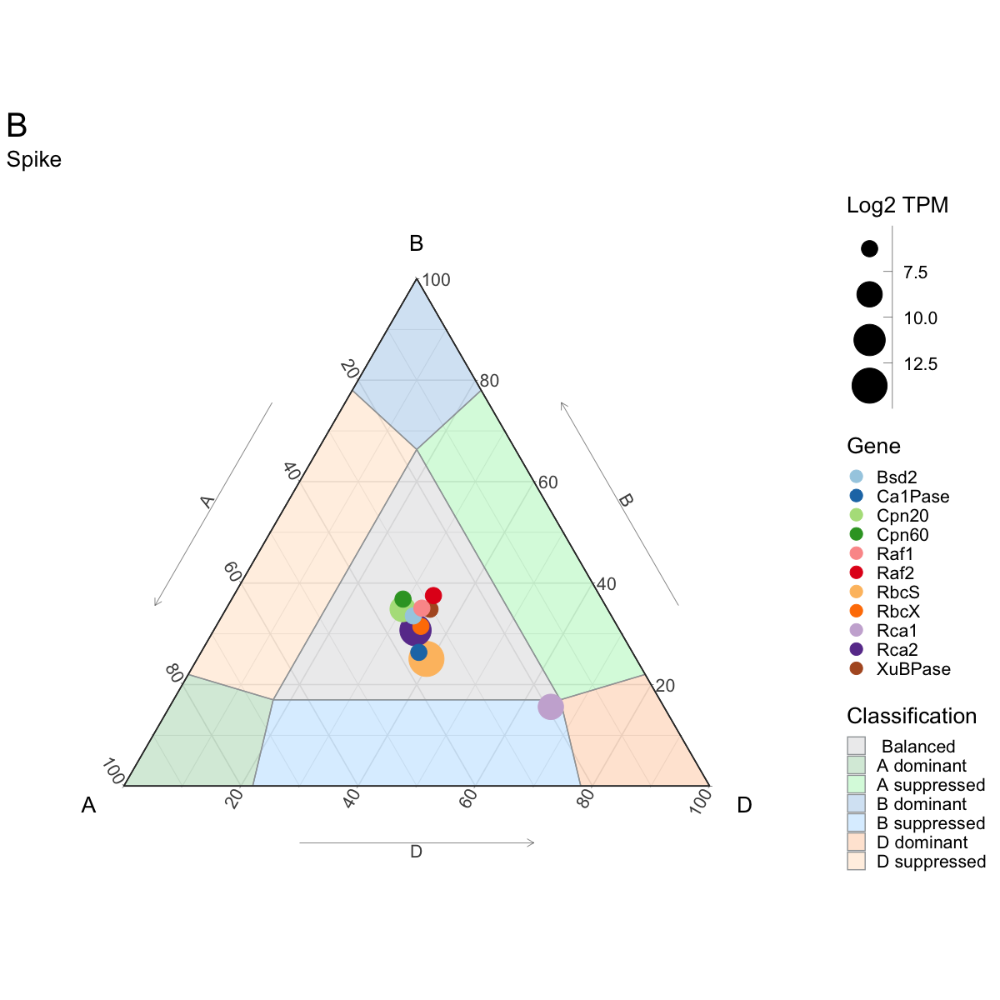
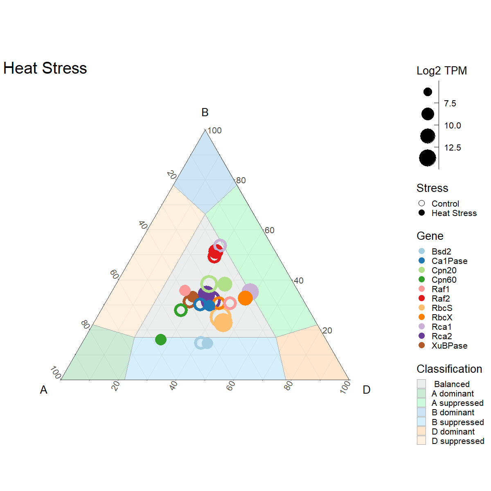
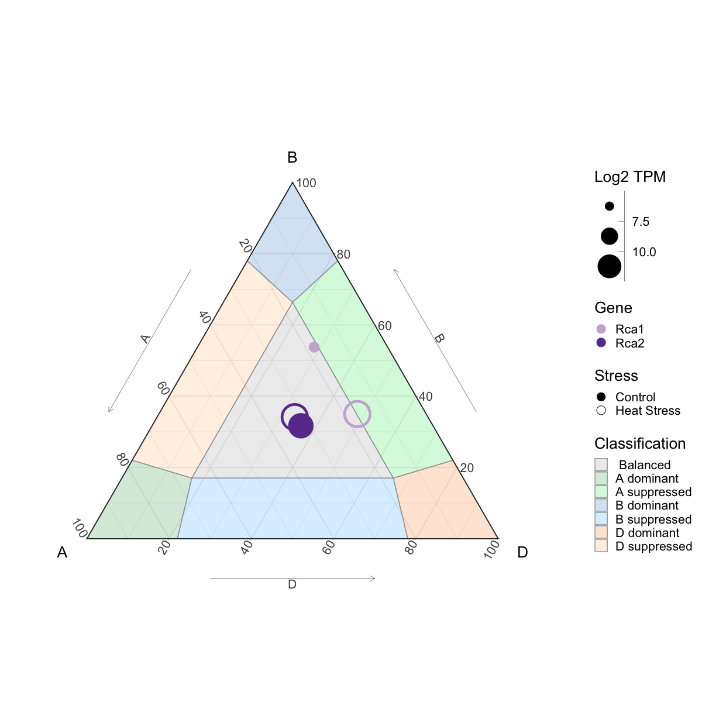

Wheat Rubiscosome Expression Balance Report
================

-   [Data Import](#data-import)
    -   [Data imported as triads](#data-imported-as-triads)
    -   [Create `initial_tidy` Function](#create-initial_tidy-function)
    -   [Compile all data into
        `Rubiscosome_exp_data`](#compile-all-data-into-rubiscosome_exp_data)
-   [Data Analysis](#data-analysis)
    -   [Split `Rubiscosome_exp_data` into three separte
        dataframes](#split-rubiscosome_exp_data-into-three-separte-dataframes)
    -   [Leaves and Shoots Data
        Summary](#leaves-and-shoots-data-summary)
    -   [Spike Data Summary](#spike-data-summary)
    -   [Heat Stress Summary](#heat-stress-summary)
-   [Data Vizualisation](#data-vizualisation)
    -   [Base](#base)

# Data Import

This study will only use data from the 7 studies listed below, that
report similar non stress growth conditions in their manuscript;

| Study Name                                                   | Study Code    |
|--------------------------------------------------------------|---------------|
| Developmental time-course of Chinese Spring                  | choulet\_URGI |
| Chinese Spring seedling and spikes at anthesis               | CS\_methylome |
| Chinese Spring leaves and roots from seven leaf stage        | Aneuploidy    |
| Chinese Spring early meiosis, early prophase                 | PRJEB25586    |
| Developmental time-course of Azhurnaya                       | Development   |
| Gene expression during a time course of flag leaf senescence | PRJNA497810   |
| Drought and heat stress time course in seedlings\*           | SRP045409     |

\*Data from this study will exclusively be used for the heat stress
analysis

### Data imported as triads

``` r
Gene_IDs <- read.csv('Rubiscosome_Gene_IDs.csv')
Gene_IDs
```

    ##       Gene         A_Subgenome        B_Subgenome        D_Subgenome
    ## 1     Bsd2  TraesCS7A02G341000 TraesCS7B02G242200 TraesCS7D02G338600
    ## 2  Ca1Pase  TraesCS4A02G184100 TraesCS4B02G134600 TraesCS4D02G129300
    ## 3  Cpn20_1  TraesCS2A02G146000 TraesCS2B02G171400 TraesCS2D02G150600
    ## 4  Cpn20_2  TraesCS6A02G340300 TraesCS6B02G371500 TraesCS6D02G320800
    ## 5  Cpn20_3  TraesCS7A02G161000 TraesCS7B02G066000 TraesCS7D02G162300
    ## 6  Cpn20_4  TraesCS5A02G212500 TraesCS5B02G211200 TraesCS5D02G219500
    ## 7  Cpn60_1  TraesCS5A02G366800 TraesCS5B02G368900 TraesCS5D02G376000
    ## 8  Cpn60_2  TraesCS4A02G315500 TraesCS5B02G563900 TraesCS5D02G550700
    ## 9   RbcS_1  TraesCS2A02G066700 TraesCS2B02G079100 TraesCS2D02G065100
    ## 10  RbcS_2  TraesCS2A02G066800 TraesCS2B02G079200 TraesCS2D02G065200
    ## 11  RbcS_3  TraesCS2A02G066900 TraesCS2B02G079300 TraesCS2D02G065300
    ## 12  RbcS_4  TraesCS2A02G067000 TraesCS2B02G079400 TraesCS2D02G065400
    ## 13  RbcS_5 TraesCS2A02G067100  TraesCS2B02G079500 TraesCS2D02G065500
    ## 14  RbcS_6  TraesCS2A02G067200                                      
    ## 15  RbcS_7  TraesCS2A02G067300 TraesCS2B02G078900 TraesCS2D02G065600
    ## 16  RbcS_8  TraesCS5A02G165400 TraesCS5B02G162600 TraesCS5D02G169600
    ## 17  RbcS_9  TraesCS5A02G165700 TraesCS5B02G162800 TraesCS5D02G169900
    ## 18    Rca1  TraesCS4A02G177600 TraesCS4B02G140200 TraesCS4D02G134900
    ## 19    Rca2  TraesCS4A02G177500 TraesCS4B02G140300 TraesCS4D02G135000
    ## 20    Raf1  TraesCS1A02G142000 TraesCS1B02G159700 TraesCS1D02G141100
    ## 21    Raf2  TraesCS5A02G545700 TraesCS4B02G379500  TraesCSU02G129700
    ## 22  RbcX_1  TraesCS5A02G459200 TraesCS5B02G468800 TraesCS5D02G470300
    ## 23  RbcX_2  TraesCS2A02G198700 TraesCS2B02G226100 TraesCS2D02G206500
    ## 24 XuBPase  TraesCS7A02G335600 TraesCS7B02G247200 TraesCS7D02G343300

### Create `initial_tidy` Function

-   Filters data for only the study codes in the above table
-   Adds a Gene and Triad column containing strings supplied under y and
    z
-   Renames the Gene\_ID column names to subgenome\_tpm e.g. `A_tpm`
-   Selects for only relevent columns

``` r
initial_tidy <- function(x, y="GeneName", z="Triad") {x %>%
    filter(study %in% c("choulet_URGI", 
                        "CS_methylome",
                        "Aneuploidy",
                        "PRJEB25586", 
                        "Development", 
                        "PRJNA497810",
                        "SRP045409")) %>%
    mutate(Gene = y,
           Triad = z) %>%
    rename(A_tpm = 13,
           B_tpm = 14,
           D_tpm = 15) %>%
    select("Gene",
           "Triad",
           "study",
           "High.level.tissue",
           "Intermediate.stress",
           "Stress.disease",
           "A_tpm",
           "B_tpm",
           "D_tpm")
  
}
```

``` r
Bsd2 <- initial_tidy(read.csv('Data/Bsd2.csv'), 'Bsd2', 'Bsd2')
Ca1Pase <- initial_tidy(read.csv('Data/Ca1Pase.csv'), 'Ca1Pase', 'Ca1Pase')
Cpn20_1 <- initial_tidy(read.csv('Data/Cpn20_1.csv'), 'Cpn20', 'Cpn20_1')
Cpn20_2 <- initial_tidy(read.csv('Data/Cpn20_2.csv'), 'Cpn20', 'Cpn20_2')
Cpn20_3 <- initial_tidy(read.csv('Data/Cpn20_3.csv'), 'Cpn20', 'Cpn20_3')
Cpn20_4 <- initial_tidy(read.csv('Data/Cpn20_4.csv'), 'Cpn20', 'Cpn20_4')
Cpn60_1 <- initial_tidy(read.csv('Data/Cpn60_1.csv'), 'Cpn60', 'Cpn60_1')
Cpn60_2 <- initial_tidy(read.csv('Data/Cpn60_2.csv'), 'Cpn60', 'Cpn60_2')
RbcS_1 <- initial_tidy(read.csv('Data/RbcS_1.csv'), 'RbcS', 'RbcS_1')
RbcS_2 <- initial_tidy(read.csv('Data/RbcS_2.csv'), 'RbcS', 'RbcS_2')
RbcS_3 <- initial_tidy(read.csv('Data/RbcS_3.csv'), 'RbcS', 'RbcS_3')
RbcS_4 <- initial_tidy(read.csv('Data/RbcS_4.csv'), 'RbcS', 'RbcS_4')
RbcS_5 <- initial_tidy(read.csv('Data/RbcS_5.csv'), 'RbcS', 'RbcS_5')
RbcS_6 <- initial_tidy(read.csv('Data/RbcS_6.csv'), 'RbcS', 'RbcS_6')
RbcS_7 <- initial_tidy(read.csv('Data/RbcS_7.csv'), 'RbcS', 'RbcS_7')
RbcS_8 <- initial_tidy(read.csv('Data/RbcS_8.csv'), 'RbcS', 'RbcS_8')
RbcS_9 <- initial_tidy(read.csv('Data/RbcS_9.csv'), 'RbcS', 'RbcS_9')
Rca1 <- initial_tidy(read.csv('Data/Rca1.csv'), 'Rca1', 'Rca1')
Rca2 <- initial_tidy(read.csv('Data/Rca2.csv'), 'Rca2', 'Rca2')
Raf1 <- initial_tidy(read.csv('data/Raf1.csv'), 'Raf1', 'Raf1')
Raf2 <- initial_tidy(read.csv('Data/Raf2.csv'), 'Raf2', 'Raf2')
RbcX_1 <- initial_tidy(read.csv('Data/RbcX_1.csv'), 'RbcX', 'RbcX_1')
RbcX_2 <- initial_tidy(read.csv('Data/RbcX_2.csv'), 'RbcX', 'RbcX_2')
XuBPase <- initial_tidy(read.csv('Data/XuBPase.csv'), 'XuBPase', 'XuBPase')
```

### Compile all data into `Rubiscosome_exp_data`

``` r
Rubiscosome_exp_data <- Bsd2 %>%
  full_join(Ca1Pase)%>%
  full_join(Cpn20_1) %>%
  full_join(Cpn20_2) %>%
  full_join(Cpn20_3) %>%
  full_join(Cpn20_4) %>%
  full_join(Cpn60_1) %>%
  full_join(Cpn60_2) %>%
  full_join(RbcS_1) %>%
  full_join(RbcS_2) %>%
  full_join(RbcS_3) %>%
  full_join(RbcS_4) %>%
  full_join(RbcS_5) %>%
  full_join(RbcS_6) %>%
  full_join(RbcS_7) %>%
  full_join(RbcS_8) %>%
  full_join(RbcS_9) %>%
  full_join(Rca1) %>%
  full_join(Rca2) %>%
  full_join(Raf1) %>%
  full_join(Raf2) %>%
  full_join(RbcX_1) %>%
  full_join(RbcX_2) %>%
  full_join(XuBPase)
```

# Data Analysis

### Split `Rubiscosome_exp_data` into three separte dataframes

-   `Rubiscosome_exp_leaf` = Leaves and shoots data
-   `Rubiscosome_exp_spike` = Spike data
-   `Rubiscosome_exp_heat` = Data from heat stress study

``` r
Rubiscosome_exp_leaf <- Rubiscosome_exp_data %>%
  filter(study != 'SRP045409') %>%
  filter(High.level.tissue == 'le+sh')

Rubiscosome_exp_spike <- Rubiscosome_exp_data %>%
  filter(study != 'SRP045409') %>%
  filter(High.level.tissue == 'spike')

Rubiscosome_exp_heat <- Rubiscosome_exp_data %>%
  filter(study == 'SRP045409') %>%
  filter(Intermediate.stress %in% c("heat", "contr"))
```

### Leaves and Shoots Data Summary

``` r
Rubiscosome_mean_leaf <- Rubiscosome_exp_leaf %>%
  select("Triad", "A_tpm", "B_tpm", "D_tpm") %>%
  group_by(Triad) %>%
  summarise_all(mean) %>%
  ungroup() %>%
  separate(Triad, c("Gene", "Triad_Num")) %>%
  select(-"Triad_Num") %>%
  group_by(Gene) %>%
  summarise_all(sum) %>% 
  mutate(tpm_total = (A_tpm + B_tpm + D_tpm)) %>%
  mutate(log2tpm = log2(tpm_total)) %>%
  mutate(A = A_tpm/(A_tpm + B_tpm + D_tpm)) %>%
  mutate(B = B_tpm/(A_tpm + B_tpm + D_tpm)) %>%
  mutate(D = D_tpm/(A_tpm + B_tpm + D_tpm)) %>%
  mutate(log2tpm = round(log2tpm, 1))
```

### Spike Data Summary

``` r
Rubiscosome_mean_spike <- Rubiscosome_exp_spike %>%
  select("Triad", "A_tpm", "B_tpm", "D_tpm") %>%
  group_by(Triad) %>%
  summarise_all(mean) %>%
  ungroup() %>%
  separate(Triad, c("Gene", "Triad_Num")) %>%
  select(-"Triad_Num") %>%
  group_by(Gene) %>%
  summarise_all(sum) %>% 
  mutate(tpm_total = (A_tpm + B_tpm + D_tpm)) %>%
  mutate(log2tpm = log2(tpm_total)) %>%
  mutate(A = A_tpm/(A_tpm + B_tpm + D_tpm)) %>%
  mutate(B = B_tpm/(A_tpm + B_tpm + D_tpm)) %>%
  mutate(D = D_tpm/(A_tpm + B_tpm + D_tpm)) %>%
  mutate(log2tpm = round(log2tpm, 1))
```

### Heat Stress Summary

``` r
Rubiscosome_mean_heat <- Rubiscosome_exp_heat %>%
  filter(Intermediate.stress == "heat") %>%
  select("Triad", "A_tpm", "B_tpm", "D_tpm") %>%
  group_by(Triad) %>%
  summarise_all(mean) %>%
  ungroup() %>%
  separate(Triad, c("Gene", "Triad_Num")) %>%
  select(-"Triad_Num") %>%
  group_by(Gene) %>%
  summarise_all(sum) %>%
  mutate(tpm_total = (A_tpm + B_tpm + D_tpm)) %>%
  mutate(log2tpm = log2(tpm_total)) %>%
  mutate(Stress = 'Heat Stress') %>%
  mutate(A = A_tpm/(A_tpm + B_tpm + D_tpm)) %>%
  mutate(B = B_tpm/(A_tpm + B_tpm + D_tpm)) %>%
  mutate(D = D_tpm/(A_tpm + B_tpm + D_tpm))
  
Rubiscosome_mean_contr <- Rubiscosome_exp_heat %>%
  filter(Intermediate.stress == "contr") %>%
  select("Triad", "A_tpm", "B_tpm", "D_tpm") %>%
  group_by(Triad) %>%
  summarise_all(mean) %>%
  ungroup() %>%
  separate(Triad, c("Gene", "Triad_Num")) %>%
  select(-"Triad_Num") %>%
  group_by(Gene) %>%
  summarise_all(sum) %>%
  mutate(tpm_total = (A_tpm + B_tpm + D_tpm)) %>%
  mutate(log2tpm = log2(tpm_total)) %>%
  mutate(Stress = 'Control') %>%
  mutate(A = A_tpm/(A_tpm + B_tpm + D_tpm)) %>%
  mutate(B = B_tpm/(A_tpm + B_tpm + D_tpm)) %>%
  mutate(D = D_tpm/(A_tpm + B_tpm + D_tpm))

Rubiscosome_mean_heat_control <- full_join(Rubiscosome_mean_heat, Rubiscosome_mean_contr ) %>%
  mutate(log2tpm = round(log2tpm, 1))
```

    ## Joining, by = c("Gene", "A_tpm", "B_tpm", "D_tpm", "tpm_total", "log2tpm", "Stress", "A", "B", "D")

# Data Vizualisation

### Base

``` r
#Build a library of points, left to right, top to bottom...
points <- data.frame(
  rbind(c( 1,1.000,0.000,0.000),
        c( 2,0.780,0.220,0.000),
        c( 3,0.660,0.170,0.170),
        c( 4,0.780,0.000,0.220),
        c( 5,0.220,0.780,0.000),
        c( 6,0.220,0.000,0.780),
        c( 7,0.170,0.670,0.170),
        c( 8,0.170,0.170,0.660),
        c( 9,0.000,1.000,0.000),
        c(10,0.000,0.780,0.220),
        c(11,0.000,0.220,0.780),
        c(12,0.000,0.000,1.000),
        c(13,0.660,0.170,0.170),
        c(14,0.170,0.170,0.660),
        c(15,0.220,0.000,0.780),
        c(16,0.780,0.000,0.220),
        c(17,0.660,0.170,0.170),
        c(18,0.170,0.670,0.170),
        c(19,0.220,0.780,0.000),
        c(20,0.780,0.220,0.000),
        c(21,0.170,0.670,0.170),
        c(22,0.170,0.170,0.660),
        c(23,0.000,0.220,0.780),
        c(24,0.000,0.780,0.220)
  )
)
colnames(points) = c("IDPoint","A","B","D")

base <- ggtern(data=points,aes(A,B,D)) +
  theme_bw() + theme_hidetitles() + theme_hidearrows() +
  geom_point(shape=21,size=10,color="blue",fill="white") +
  geom_text(aes(label=IDPoint),color="blue")


#Give each Polygon a number
polygon.labels <- data.frame(
  Label=c("A dominant","",
          " Balanced",
          "E",
          "F",
          "G",
          "H",
          "I",
          "B dominant",
          "K",
          "L",
          "D dominant",
          "B suppressed",
          "O",
          "P",
          "Q",
          "D suppressed",
          "S",
          "T",
          "U",
          "A suppressed",
          "W",
          "X",
          "Y",
          "Z",
          "C"))
#Assign each label an index
polygon.labels$IDLabel=1:nrow(polygon.labels)


#Create a map of polygons to points
polygons <- data.frame(
  rbind(c(1,1),c(1,2),c(1,3),c(1,4),
        c(9,9),c(9,10),c(9,7),c(9,5),
        c(12,12),c(12,6),c(12,8),c(12,11),
        c(3,3),c(3,7),c(3,8),
        c(13,13),c(13,14),c(13,15),c(13,16),
        c(17,17),c(17,18),c(17,19),c(17,20),
        c(21,21),c(21,22),c(21,23),c(21,24)
  )
)
#IMPORTANT FOR CORRECT ORDERING.
polygons$PointOrder <- 1:nrow(polygons)

#Rename the columns
colnames(polygons) = c("IDLabel","IDPoint","PointOrder")


#Merge the three sets together to create a master set.
df <- merge(polygons,points)
df <- merge(df,polygon.labels)
df <- df[order(df$PointOrder),]


#Build the final plot
base <- ggtern(data=df,aes(A,B,D)) +
  geom_polygon(aes(fill=Label,group=Label),color="black",alpha=0.25) +
  theme_bw() +
  custom_percent("Percent") +
  labs(title="Shepard Sediment Classification Diagram",
       fill = "Classification")
```

``` r
LeavesShoots <- ggtern(data=df,aes(A,B,D)) +
  geom_polygon(aes(fill=Label,group=Label),color="#A0A4A7",alpha=0.20) +
   scale_fill_manual(values=c("#A0A4A7", "#009933", "#00E64D", "#007ACC",
                              "#33ADFF", "#FF8000", "#FFB366")) +
  geom_point(data=Rubiscosome_mean_leaf%>%
               arrange(desc(log2tpm)),
             aes(A,B,D, 
                 color=Gene,
                 size=log2tpm)) + 
  scale_size_binned(range = c(1, 15),
                    breaks = c(7.5, 10, 12.5)) +
  scale_color_manual(values=c("#a6cee3", "#1f78b4", "#b2df8a", "#33a02c",
                              "#fb9a99", "#e31a1c", "#fdbf6f", "#ff7f00",
                              "#cab2d6", "#6a3d9a", "#b15928" )) +
  theme_bw() +
  guides(colour = guide_legend(override.aes = list(size=5))) +
  theme(plot.title = element_text(size = 30),
        text = element_text(size=20))+
  labs(title="Leaves and Shoots",
       fill = "Classification",
       T="B",
       L="A",
       R="D",
       size="Log2 TPM")
LeavesShoots
```

<!-- -->

``` r
Spike <- ggtern(data=df,aes(A,B,D)) +
  geom_polygon(aes(fill=Label,group=Label),color="#A0A4A7",alpha=0.20) +
   scale_fill_manual(values=c("#A0A4A7", "#009933", "#00E64D", "#007ACC",
                              "#33ADFF", "#FF8000", "#FFB366")) +
  geom_point(data=Rubiscosome_mean_spike %>%
               arrange(desc(log2tpm)),
             aes(A,B,D, 
                 color=Gene,
                 size=log2tpm)) + 
  scale_size_binned(range = c(1, 15),
                    breaks = c(7.5, 10, 12.5)) +
  scale_color_manual(values=c("#a6cee3", "#1f78b4", "#b2df8a", "#33a02c",
                              "#fb9a99", "#e31a1c", "#fdbf6f", "#ff7f00",
                              "#cab2d6", "#6a3d9a", "#b15928" )) +
  theme_bw() +
  guides(colour = guide_legend(override.aes = list(size=5))) +
  theme(plot.title = element_text(size = 30),
        text = element_text(size=20))+
  labs(title="Spike",
       fill = "Classification",
       T="B",
       L="A",
       R="D",
       size="Log2 TPM")
Spike
```

<!-- -->

``` r
HeatStress <- ggtern(data=df,aes(A,B,D)) +
  geom_polygon(aes(fill=Label,group=Label),color="#A0A4A7",alpha=0.2) +
   scale_fill_manual(values=c("#A0A4A7", "#009933", "#00E64D", "#007ACC",
                              "#33ADFF", "#FF8000", "#FFB366")) +
  geom_point(data=Rubiscosome_mean_heat_control %>%
               arrange(desc(log2tpm)),
             aes(A,B,D, 
                 color=Gene,
                 size=log2tpm,
                 shape=Stress,
                 stroke=4)) +
  scale_shape_manual(values=c(21, 16)) +
  scale_size_binned(range = c(1, 15),
                    breaks = c(7.5, 10, 12.5)) +
  scale_color_manual(values=c("#a6cee3", "#1f78b4", "#b2df8a", "#33a02c",
                              "#fb9a99", "#e31a1c", "#fdbf6f", "#ff7f00",
                              "#cab2d6", "#6a3d9a", "#b15928" )) +
  theme_bw() +
  guides(colour = guide_legend(override.aes = list(size=5)),
         shape = guide_legend(override.aes = list(size=5))) +
  theme(plot.title = element_text(size = 30),
        text = element_text(size=20))+
  labs(title="Heat Stress",
       fill = "Classification",
       T="B",
       L="A",
       R="D",
       size="Log2 TPM")
HeatStress
```

<!-- -->

``` r
HeatStressRca <- ggtern(data=df,aes(A,B,D)) +
  geom_polygon(aes(fill=Label,group=Label),color="#A0A4A7",alpha=0.2) +
   scale_fill_manual(values=c("#A0A4A7", "#009933", "#00E64D", "#007ACC",
                              "#33ADFF", "#FF8000", "#FFB366")) +
  geom_point(data=Rubiscosome_mean_heat_control %>% 
               filter(Gene %in% c("Rca1", "Rca2")) %>%
               arrange(desc(log2tpm)),
             aes(A,B,D, 
                 color=Gene,
                 size=log2tpm,
                 shape=Stress,
                 stroke = 4)) +
  scale_shape_manual(values=c(21, 16)) +
  scale_size_binned(range = c(1, 15),
                    breaks = c(7.5, 10, 12.5)) +
  scale_color_manual(values=c("#cab2d6", "#6a3d9a")) +
  theme_bw() +
  guides(colour = guide_legend(override.aes = list(size=5)),
         shape = guide_legend(override.aes = list(size=5))) +
  theme(plot.title = element_text(size = 30),
        text = element_text(size=20))+
  labs(title="Rca Heat Stress",
       fill = "Classification",
       T="B",
       L="A",
       R="D",
       size="Log2 TPM")
HeatStressRca
```

<!-- -->
